# Term-deposit propensity under temporal drift

This project ranks retail-bank customers for a term-deposit telephone campaign. The practical
constraint is agent time: calling every customer wastes capacity and increases customer fatigue,
so the useful output is a prioritised call list rather than a default `0/1` prediction.

The repository turns the UCI Bank Marketing data into a reproducible training, evaluation, artifact,
and batch-inference workflow. It is an analytical proof of concept; nothing here is deployed or
serving customer traffic.

## Headline finding: a random split overstates customer-level signal

For Random Forest, a stratified random test reports **0.8116 pooled ROC-AUC**, but the row-weighted
ROC-AUC measured separately inside each contact month is only **0.5865**. The **+0.2251** gap is
calendar signal that would not help rank customers in one monthly campaign batch.

Why: four macro variables are exactly determined by contact month and `euribor3m` is 99.96%
determined by it. Meanwhile the observed subscription rate moves from **3.1% in May 2008** to
**57.5% in May 2010**. A random split puts rows from the same months in training and test, allowing a
model to recover a month's base rate; operational scoring compares customers within one period, where
those macro variables have little or no variation.

This does not make the models useless. It changes the claim from “the model separates arbitrary
customers at 0.81 ROC-AUC” to the narrower question this project now measures: “how well does it rank
customers within a future campaign period?”

## Results

All figures below come from the checked-in generated reports. `duration`, which is known only after a
call ends, is excluded. Average precision (AP) is always shown with its no-skill reference: the base
rate.

### Model selection: nine-month rolling-origin backtest

Each fold trains on all earlier periods and scores the next month. Model selection uses mean backtest
AP, not the single out-of-time window.

| Model | Mean base rate | Mean AP | Mean ROC-AUC | Mean lift@20% |
|---|---:|---:|---:|---:|
| **Random Forest** | 0.5170 | **0.7417** | **0.7421** | **1.5709** |
| XGBoost | 0.5170 | 0.7297 | 0.7271 | 1.5271 |
| Logistic Regression | 0.5170 | 0.7279 | 0.7281 | 1.5188 |
| Gradient Boosting | 0.5170 | 0.7237 | 0.7249 | 1.5468 |
| Prior baseline | 0.5170 | 0.5170 | 0.5000 | 0.9992 |

Random Forest won by mean backtest AP. Its monthly AP ranges from 0.6526 to 0.8457 across the nine
2010 folds, so the mean is more informative than a single convenient cut-off.

### Out-of-time test: train through May 2009, test March-November 2010

The split contains 36,224 training, 2,906 validation, and 2,058 test rows. Their positive rates are
6.71%, 39.09%, and 52.14%, respectively—a large regime shift.

| Model | Base rate | AP | ROC-AUC | Within-period ROC-AUC | Precision@20% | Lift@20% | Brier | ECE |
|---|---:|---:|---:|---:|---:|---:|---:|---:|
| **Random Forest** | 0.5214 | **0.6807** | **0.6993** | **0.7327** | **0.7597** | **1.4571** | **0.2447** | 0.1419 |
| Logistic Regression | 0.5214 | 0.6264 | 0.6463 | 0.7024 | 0.6019 | 1.1545 | 0.2465 | 0.1319 |
| Gradient Boosting | 0.5214 | 0.6055 | 0.6143 | 0.6482 | 0.6772 | 1.2988 | 0.2596 | 0.1377 |
| XGBoost | 0.5214 | 0.5783 | 0.5780 | 0.6114 | 0.6165 | 1.1824 | 0.2656 | 0.1319 |
| Prior baseline | 0.5214 | 0.5214 | 0.5000 | 0.5000 | 0.5097 | 0.9776 | 0.2666 | 0.1305 |

The ranking still beats the prior baseline, especially at constrained capacity. Calibration does not
survive the regime shift: test ECE is about 0.13-0.14 even though it is 0.004-0.014 under the random,
in-distribution protocol. Treat the out-of-time probabilities as scores until recalibrated on current
data.

### Stratified random test: retained as a diagnostic

| Model | Base rate | AP | Pooled ROC-AUC | Within-period ROC-AUC | Inflation | Precision@20% | Lift@20% | ECE |
|---|---:|---:|---:|---:|---:|---:|---:|---:|
| **Random Forest** | 0.1126 | **0.4665** | **0.8116** | 0.5865 | +0.2251 | 0.3701 | 3.2858 | 0.0088 |
| XGBoost | 0.1126 | 0.4663 | 0.8105 | 0.5919 | +0.2186 | **0.3732** | **3.3128** | **0.0044** |
| Gradient Boosting | 0.1126 | 0.4628 | 0.8104 | **0.5943** | +0.2161 | 0.3695 | 3.2805 | 0.0103 |
| Logistic Regression | 0.1126 | 0.4401 | 0.8002 | 0.5575 | +0.2427 | 0.3647 | 3.2374 | 0.0136 |
| Prior baseline | 0.1126 | 0.1126 | 0.5000 | 0.5000 | 0.0000 | 0.1092 | 0.9696 | 0.0000 |

The high pooled score is reproducible, but it answers an easier question because every month appears
on both sides of the split. The within-period column is the deployment-relevant diagnostic.

## Architecture

```mermaid
flowchart LR
    A[UCI archive] --> B[SHA-256 and schema validation]
    B --> C[Reconstruct contact month]
    C --> D[Random or out-of-time split]
    D --> E[Column selection and pdays sentinel encoding]
    E --> F[Scale and one-hot encode inside Pipeline]
    F --> G[Fit candidate models]
    G --> H[Isotonic calibration on validation]
    H --> I[Choose threshold on validation]
    I --> J[Test and rolling backtest]
    J --> K[JSON and CSV reports]
    J --> L[model.joblib and metadata.json]
    L --> M[Validated batch inference]
    M --> N[Ranked and tiered call list]
```



Preprocessing is fitted inside each estimator pipeline, and the calibrated scorer is persisted with
its input contract and decision metadata. The calendar key is used for splitting and reporting only;
it is never a model feature.

```text
.
├── configs/                 # layered, validated YAML configuration
├── data/                    # raw and generated data; contents are gitignored
├── docs/                    # methodology, architecture, model card, ADRs, assets
├── notebooks/exploratory/   # original pre-refactor analysis
├── reports/                 # generated figures and metric tables
├── scripts/                 # thin executable entry points
├── src/term_deposit/        # data, features, models, evaluation, training, inference
├── tests/                   # synthetic unit and integration tests
├── Dockerfile
├── Makefile
└── pyproject.toml
```

See [software architecture](docs/architecture.md) for module and runtime details.

## Quickstart

Requirements: Python 3.11 or 3.12, [`uv`](https://docs.astral.sh/uv/), and network access for the
first dataset download.

```bash
git clone https://github.com/criscotero/banking-marketing-data-eda.git
cd banking-marketing-data-eda
uv sync --all-extras
```

Download, checksum, validate, and profile the dataset:

```bash
make data
```

Run both evaluation protocols. The full path trains five candidates, runs five-fold CV and the
nine-period rolling backtest, writes reports, and persists the selected model:

```bash
make compare-protocols
```

Re-evaluate the saved artifact and render figures:

```bash
make evaluate
```

Create a ranked call list, retaining the configured 20% capacity if requested directly:

```bash
uv run python scripts/predict.py \
  --config configs/base.yaml \
  --config configs/inference.yaml \
  --input data/raw/bank-additional-full.csv \
  --output reports/metrics/call_list.csv \
  --capacity 0.20
```

Useful checks:

```bash
make check
make docker-test
```

Configuration files are merged left to right, and CLI overrides are parsed as YAML:

```bash
uv run python scripts/train.py \
  --config configs/base.yaml \
  --config configs/training.yaml \
  --set split.strategy=random \
  --set features.feature_set=client_only
```

## Modelling decisions

### Average precision before ROC-AUC

AP focuses on ordering the positive class and has a visible no-skill value equal to the positive
rate. ROC-AUC remains useful, but a pooled value can look strong here primarily because the model
separates high-response months from low-response months.

### Lift and precision at capacity

A call centre consumes the top of a ranking, not every thresholded record. Precision@k estimates the
yield in the callable slice; lift@k compares that yield with random ordering at the same base rate.

### Out-of-time evaluation and rolling backtests

The default split trains on early periods, calibrates on the next seven, and tests on the final nine.
The expanding-window backtest repeats the operational pattern across months and supplies the metric
used for model selection.

### Validation-chosen thresholds

Each threshold is selected on validation and frozen before test evaluation. The configured
expected-value objective uses placeholder values of 100 per subscription and 5 per call; these are
explicit assumptions, not measured euros. Under the 2010 regime this rule effectively calls everyone,
showing that ranking and capacity limits are more defensible than the hard class output.

### `duration` is excluded

Call duration is only known after the call. Using it in a pre-call model would leak the outcome and
make the feature unavailable at the actual decision point.

### `unknown` remains a category

The source records literal `unknown` values rather than nulls. They are retained because they may
describe how the CRM captured the record; before operational use, their relationship with protected
or vulnerable groups must be audited.

### The `pdays` sentinel is split

`pdays == 999` means “never contacted”, not 999 elapsed days. The pipeline replaces it with a flag and
a real days-since-contact value so scaling and linear models do not assign false distance to a code.

### Calibration is held out

Class weights improve ranking but distort the probability scale. An isotonic mapping is fitted only
on validation; the out-of-time ECE result shows why calibration must be monitored and refreshed after
a base-rate shift.

### A prior baseline is mandatory

`DummyClassifier(strategy="prior")` makes the no-skill reference executable. A candidate that cannot
beat base-rate AP or lift near one does not justify operational complexity.

### Why Random Forest is persisted

Random Forest has the highest mean rolling-backtest AP (0.7417) and lift@20% (1.5709). The choice is
evidence from these runs, not a universal claim that it will remain best on current banking data.

## Engineering

| Gate | Current implementation |
|---|---|
| Tests | 343 tests; 331 run on synthetic fixtures with no network, the rest pin documented claims against the real dataset |
| Lint and format | Ruff |
| Types | mypy strict mode |
| CI | Python 3.11 and 3.12 matrix, config/CLI checks, Docker build |
| Reproducibility | lockfile, seed 42, SHA-256, deterministic top-k ties, optional BLAS pinning |
| Packaging | `src/` package, Typer CLI, multi-stage Docker image |

The real-dataset end-to-end CI job runs on `main` or manually and is non-blocking because it depends on
UCI availability. Pull requests use synthetic fixtures and do not download data.

## What this project does not do

- It is not deployed and exposes no HTTP service, authentication, CRM integration, scheduler, or
  provisioned cloud infrastructure.
- It does not establish that contacting a customer causes subscription; propensity is not treatment
  effect.
- It has no external or contemporary validation. The population is Portuguese retail-bank customers
  contacted during 2008-2010, including the financial-crisis period.
- The out-of-time test is only 2,058 rows across nine months, and its 52.14% base rate is far above the
  6.71% training rate.
- Calendar reconstruction assumes the source row order is chronological. A plausibility guard catches
  grossly shuffled input but cannot prove perfect ordering.
- Isotonic calibration fitted on the validation period does not remain calibrated after the regime
  change; absolute probabilities should not be used without current recalibration data.
- The 100/5 expected-value inputs are placeholders. No bank cost study or capacity schedule supplied
  them.
- No systematic hyperparameter search, external benchmark, or causal experiment was run.
- No fairness or subgroup performance audit was run despite use of age, job, education, marital,
  housing, and loan attributes.
- Macro indicators are period proxies in this extract. Reporting within-period performance limits the
  claim; it does not prove the same relationship will hold in future data.
- Joblib artifacts are library-version-sensitive. Their metadata records the training environment but
  does not make the binary portable across arbitrary versions.
- SHAP is available as an optional dependency, but the reported runs have explainability disabled and
  make no SHAP-based claim.
- The historical notebook is retained as provenance; its random-split conclusions are superseded by
  the pipeline reports.
- The Azure image in `docs/assets/` is a design sketch, not evidence of provisioned resources.

## Production path

Before deployment, the bank would need to define actual campaign capacity and economics, collect a
current representative validation window, audit subgroup outcomes, and decide whether regulated or
sensitive attributes may be used. The threshold should then be capacity-bound or recalibrated against
those measured costs.

Monitoring should lead with within-period ranking quality, base-rate and feature drift, calibration
error, top-k yield, and list coverage. Retraining or recalibration should be triggered by agreed limits,
not by a calendar alone. An API or scheduled batch job would still need authentication, model rollout,
rollback, observability, and CRM delivery contracts.

The [Azure MLOps diagram](docs/assets/mlops-deployment-architecture-azure.png) is only a possible design
sketch for that future work.

## Documentation

- [Methodology](docs/methodology.md)
- [Software architecture](docs/architecture.md)
- [Model card](docs/model-card.md)
- [Architecture decisions](docs/decisions/README.md)
- [Data contract](data/README.md)
- [Artifacts](artifacts/README.md)
- [Reports](reports/README.md)
- [Notebooks](notebooks/README.md)
- [Versión en español](README_es.md)

## Author

Christian Camilo Otero

Dataset: [Bank Marketing, UCI Machine Learning Repository](https://archive.ics.uci.edu/dataset/222/bank+marketing),
Moro, Cortez and Rita (2014), licensed CC BY 4.0.
