# Propensión a depósito a plazo bajo deriva temporal

> Versión en inglés: [README.md](README.md).

Este proyecto ordena a los clientes de banca minorista para una campaña telefónica de depósito a
plazo. La restricción práctica es el tiempo de los agentes: llamar a todos los clientes desperdicia
capacidad y aumenta la fatiga del cliente, por lo que el resultado útil es una call list priorizada
en lugar de una predicción `0/1` por defecto.

El repositorio convierte los datos de UCI Bank Marketing en un flujo reproducible de entrenamiento,
evaluación, artefactos e inferencia por lotes. Es una prueba de concepto analítica; nada de lo que
está aquí se encuentra desplegado ni atiende tráfico de clientes.

## Hallazgo principal: una partición aleatoria sobreestima la señal a nivel de cliente

Para Random Forest, una prueba aleatoria estratificada reporta **0.8116 de ROC-AUC agrupado**, pero el
ROC-AUC ponderado por filas, medido por separado dentro de cada mes de contacto, es apenas **0.5865**.
Esa brecha de **+0.2251** es señal de calendario que no ayudaría a ordenar clientes dentro de un mismo
lote mensual de campaña.

La razón: cuatro variables macroeconómicas quedan determinadas exactamente por el mes de contacto y
`euribor3m` lo está en un 99.96%. Al mismo tiempo, la tasa de suscripción observada pasa de **3.1% en
mayo de 2008** a **57.5% en mayo de 2010**. Una partición aleatoria coloca filas de los mismos meses
tanto en entrenamiento como en prueba, lo que permite al modelo recuperar la tasa base del mes; en
cambio, el scoring operativo compara clientes dentro de un mismo periodo, donde esas variables
macroeconómicas tienen poca o ninguna variación.

Esto no vuelve inútiles a los modelos. Cambia la afirmación de "el modelo separa clientes arbitrarios
con 0.81 de ROC-AUC" a la pregunta más acotada que este proyecto mide ahora: "¿qué tan bien ordena
clientes dentro de un periodo futuro de campaña?".

## Resultados

Todas las cifras que siguen provienen de los reportes generados que están versionados en el
repositorio. Se excluye `duration`, que solo se conoce una vez terminada la llamada. El average
precision (AP) siempre se muestra junto a su referencia sin habilidad: la tasa base.

### Selección de modelo: backtest rolling-origin de nueve meses

Cada fold entrena con todos los periodos anteriores y puntúa el mes siguiente. La selección de modelo
usa el AP promedio del backtest, no la única ventana out-of-time.

| Modelo | Tasa base media | AP medio | ROC-AUC medio | Lift@20% medio |
|---|---:|---:|---:|---:|
| **Random Forest** | 0.5170 | **0.7417** | **0.7421** | **1.5709** |
| XGBoost | 0.5170 | 0.7297 | 0.7271 | 1.5271 |
| Logistic Regression | 0.5170 | 0.7279 | 0.7281 | 1.5188 |
| Gradient Boosting | 0.5170 | 0.7237 | 0.7249 | 1.5468 |
| Baseline de prior | 0.5170 | 0.5170 | 0.5000 | 0.9992 |

Random Forest ganó por AP promedio del backtest. Su AP mensual va de 0.6526 a 0.8457 a lo largo de los
nueve folds de 2010, de modo que el promedio es más informativo que un único corte conveniente.

### Prueba out-of-time: entrenamiento hasta mayo de 2009, prueba de marzo a noviembre de 2010

La partición contiene 36,224 filas de entrenamiento, 2,906 de validación y 2,058 de prueba. Sus tasas
de positivos son 6.71%, 39.09% y 52.14%, respectivamente: un cambio de régimen considerable.

| Modelo | Tasa base | AP | ROC-AUC | ROC-AUC intraperiodo | Precision@20% | Lift@20% | Brier | ECE |
|---|---:|---:|---:|---:|---:|---:|---:|---:|
| **Random Forest** | 0.5214 | **0.6807** | **0.6993** | **0.7327** | **0.7597** | **1.4571** | **0.2447** | 0.1419 |
| Logistic Regression | 0.5214 | 0.6264 | 0.6463 | 0.7024 | 0.6019 | 1.1545 | 0.2465 | 0.1319 |
| Gradient Boosting | 0.5214 | 0.6055 | 0.6143 | 0.6482 | 0.6772 | 1.2988 | 0.2596 | 0.1377 |
| XGBoost | 0.5214 | 0.5783 | 0.5780 | 0.6114 | 0.6165 | 1.1824 | 0.2656 | 0.1319 |
| Baseline de prior | 0.5214 | 0.5214 | 0.5000 | 0.5000 | 0.5097 | 0.9776 | 0.2666 | 0.1305 |

El ordenamiento sigue superando al baseline de prior, sobre todo con capacidad restringida. La
calibración no sobrevive al cambio de régimen: el ECE de prueba ronda 0.13-0.14, aunque es de
0.004-0.014 bajo el protocolo aleatorio dentro de distribución. Conviene tratar las probabilidades
out-of-time como puntajes hasta recalibrarlas con datos actuales.

### Prueba aleatoria estratificada: se conserva como diagnóstico

| Modelo | Tasa base | AP | ROC-AUC agrupado | ROC-AUC intraperiodo | Inflación | Precision@20% | Lift@20% | ECE |
|---|---:|---:|---:|---:|---:|---:|---:|---:|
| **Random Forest** | 0.1126 | **0.4665** | **0.8116** | 0.5865 | +0.2251 | 0.3701 | 3.2858 | 0.0088 |
| XGBoost | 0.1126 | 0.4663 | 0.8105 | 0.5919 | +0.2186 | **0.3732** | **3.3128** | **0.0044** |
| Gradient Boosting | 0.1126 | 0.4628 | 0.8104 | **0.5943** | +0.2161 | 0.3695 | 3.2805 | 0.0103 |
| Logistic Regression | 0.1126 | 0.4401 | 0.8002 | 0.5575 | +0.2427 | 0.3647 | 3.2374 | 0.0136 |
| Baseline de prior | 0.1126 | 0.1126 | 0.5000 | 0.5000 | 0.0000 | 0.1092 | 0.9696 | 0.0000 |

El puntaje agrupado alto es reproducible, pero responde a una pregunta más fácil, porque cada mes
aparece en ambos lados de la partición. La columna intraperiodo es el diagnóstico relevante para un
despliegue.

## Arquitectura

```mermaid
flowchart LR
    A[Archivo UCI] --> B[SHA-256 y validación de esquema]
    B --> C[Reconstrucción del mes de contacto]
    C --> D[Partición aleatoria u out-of-time]
    D --> E[Selección de columnas y codificación del centinela pdays]
    E --> F[Escalado y one-hot encoding dentro del Pipeline]
    F --> G[Ajuste de modelos candidatos]
    G --> H[Calibración isotónica en validación]
    H --> I[Elección de umbral en validación]
    I --> J[Prueba y backtest rolling]
    J --> K[Reportes JSON y CSV]
    J --> L[model.joblib y metadata.json]
    L --> M[Inferencia por lotes validada]
    M --> N[Call list ordenada y segmentada por niveles]
```



El preprocesamiento se ajusta dentro del pipeline de cada estimador, y el scorer calibrado se persiste
junto con su contrato de entrada y sus metadatos de decisión. La clave de calendario se usa solamente
para particionar y reportar; nunca es una feature del modelo.

```text
.
├── configs/                 # configuración YAML en capas y validada
├── data/                    # datos crudos y generados; el contenido está en gitignore
├── docs/                    # metodología, arquitectura, model card, ADRs, recursos
├── notebooks/exploratory/   # análisis original previo a la refactorización
├── reports/                 # figuras y tablas de métricas generadas
├── scripts/                 # puntos de entrada ejecutables y delgados
├── src/term_deposit/        # datos, features, modelos, evaluación, entrenamiento, inferencia
├── tests/                   # pruebas unitarias y de integración con datos sintéticos
├── Dockerfile
├── Makefile
└── pyproject.toml
```

Consulta la [arquitectura de software](docs/architecture.md) para conocer los detalles de módulos y de
ejecución.

## Inicio rápido

Requisitos: Python 3.11 o 3.12, [`uv`](https://docs.astral.sh/uv/) y acceso a red para la primera
descarga del dataset.

```bash
git clone https://github.com/criscotero/banking-marketing-data-eda.git
cd banking-marketing-data-eda
uv sync --all-extras
```

Descargar, verificar el checksum, validar y perfilar el dataset:

```bash
make data
```

Ejecutar ambos protocolos de evaluación. La ruta completa entrena cinco candidatos, corre validación
cruzada de cinco folds y el backtest rolling de nueve periodos, escribe los reportes y persiste el
modelo seleccionado:

```bash
make compare-protocols
```

Reevaluar el artefacto guardado y generar las figuras:

```bash
make evaluate
```

Crear una call list ordenada, conservando el 20% de capacidad configurado si se solicita
directamente:

```bash
uv run python scripts/predict.py \
  --config configs/base.yaml \
  --config configs/inference.yaml \
  --input data/raw/bank-additional-full.csv \
  --output reports/metrics/call_list.csv \
  --capacity 0.20
```

Verificaciones útiles:

```bash
make check
make docker-test
```

Los archivos de configuración se fusionan de izquierda a derecha, y los overrides de CLI se
interpretan como YAML:

```bash
uv run python scripts/train.py \
  --config configs/base.yaml \
  --config configs/training.yaml \
  --set split.strategy=random \
  --set features.feature_set=client_only
```

## Decisiones de modelado

### Average precision antes que ROC-AUC

El AP se concentra en el ordenamiento de la clase positiva y tiene un valor sin habilidad visible,
igual a la tasa de positivos. El ROC-AUC sigue siendo útil, pero aquí un valor agrupado puede parecer
sólido sobre todo porque el modelo separa meses de alta respuesta de meses de baja respuesta.

### Lift y precisión a capacidad

Un call center consume la parte alta de un ordenamiento, no cada registro que supera un umbral. El
precision@k estima el rendimiento de la porción que sí se puede llamar; el lift@k compara ese
rendimiento con un ordenamiento aleatorio a la misma tasa base.

### Evaluación out-of-time y backtests rolling

La partición por defecto entrena con los periodos iniciales, calibra con los siete siguientes y prueba
con los nueve finales. El backtest de ventana expansiva repite el patrón operativo a lo largo de los
meses y aporta la métrica que se usa para seleccionar el modelo.

### Umbrales elegidos en validación

Cada umbral se elige en validación y se congela antes de la evaluación de prueba. El objetivo
configurado de valor esperado usa valores marcador de posición de 100 por suscripción y 5 por llamada;
son supuestos explícitos, no euros medidos. Bajo el régimen de 2010 esta regla termina llamando a
todos, lo que muestra que el ordenamiento y los límites de capacidad son más defendibles que la salida
de clase dura.

### Se excluye `duration`

La duración de la llamada solo se conoce después de la llamada. Usarla en un modelo previo al contacto
filtraría el resultado y dejaría la feature indisponible en el punto real de decisión.

### `unknown` se mantiene como categoría

La fuente registra valores literales `unknown` en lugar de nulos. Se conservan porque pueden describir
cómo el CRM capturó el registro; antes de un uso operativo, debe auditarse su relación con grupos
protegidos o vulnerables.

### El centinela de `pdays` se separa

`pdays == 999` significa "nunca contactado", no 999 días transcurridos. El pipeline lo reemplaza por
una bandera y un valor real de días desde el último contacto, para que el escalado y los modelos
lineales no asignen una distancia falsa a un código.

### La calibración se deja fuera del entrenamiento

Los pesos de clase mejoran el ordenamiento, pero distorsionan la escala de probabilidad. El mapeo
isotónico se ajusta únicamente en validación; el resultado de ECE out-of-time muestra por qué la
calibración debe monitorearse y actualizarse tras un cambio de tasa base.

### Un baseline de prior es obligatorio

`DummyClassifier(strategy="prior")` vuelve ejecutable la referencia sin habilidad. Un candidato que no
puede superar el AP de la tasa base o que tiene un lift cercano a uno no justifica la complejidad
operativa.

### Por qué se persiste Random Forest

Random Forest tiene el mayor AP promedio del backtest rolling (0.7417) y el mayor lift@20% (1.5709).
La elección es evidencia de estas corridas, no una afirmación universal de que seguirá siendo el mejor
sobre datos bancarios actuales.

## Ingeniería

| Control | Implementación actual |
|---|---|
| Pruebas | 343 pruebas; 331 se ejecutan sobre fixtures sintéticos sin red, y el resto fija contra el dataset real las afirmaciones documentadas |
| Lint y formato | Ruff |
| Tipos | mypy en modo strict |
| CI | matriz de Python 3.11 y 3.12, verificaciones de config/CLI, build de Docker |
| Reproducibilidad | lockfile, semilla 42, SHA-256, desempates deterministas en top-k, fijación opcional de BLAS |
| Empaquetado | paquete en `src/`, CLI con Typer, imagen Docker multietapa |

El job de CI end-to-end con el dataset real se ejecuta en `main` o de forma manual y no es bloqueante,
porque depende de la disponibilidad de UCI. Los pull requests usan fixtures sintéticos y no descargan
datos.

## Lo que este proyecto no hace

- No está desplegado y no expone servicio HTTP, autenticación, integración con CRM, scheduler ni
  infraestructura en la nube aprovisionada.
- No establece que contactar a un cliente cause la suscripción; la propensión no es un efecto de
  tratamiento.
- No tiene validación externa ni contemporánea. La población son clientes de banca minorista
  portuguesa contactados entre 2008 y 2010, incluido el periodo de crisis financiera.
- La prueba out-of-time son apenas 2,058 filas repartidas en nueve meses, y su tasa base de 52.14% está
  muy por encima del 6.71% de entrenamiento.
- La reconstrucción del calendario supone que el orden de filas de la fuente es cronológico. Un control
  de plausibilidad detecta entradas gravemente desordenadas, pero no puede probar un orden perfecto.
- La calibración isotónica ajustada en el periodo de validación no se mantiene calibrada tras el cambio
  de régimen; las probabilidades absolutas no deberían usarse sin datos actuales de recalibración.
- Los insumos de valor esperado 100/5 son marcadores de posición. Ningún estudio de costos del banco ni
  cronograma de capacidad los respaldó.
- No se realizó búsqueda sistemática de hiperparámetros, benchmark externo ni experimento causal.
- No se realizó auditoría de equidad ni de desempeño por subgrupos, pese al uso de los atributos edad,
  ocupación, educación, estado civil, vivienda y préstamo.
- Los indicadores macroeconómicos son proxies de periodo en este extracto. Reportar el desempeño
  intraperiodo acota la afirmación; no prueba que la misma relación se mantenga en datos futuros.
- Los artefactos de Joblib son sensibles a la versión de las librerías. Sus metadatos registran el
  entorno de entrenamiento, pero no hacen que el binario sea portable entre versiones arbitrarias.
- SHAP está disponible como dependencia opcional, pero las corridas reportadas tienen la explicabilidad
  desactivada y no formulan ninguna afirmación basada en SHAP.
- El notebook histórico se conserva como procedencia; sus conclusiones con partición aleatoria quedan
  superadas por los reportes del pipeline.
- La imagen de Azure en `docs/assets/` es un bosquejo de diseño, no evidencia de recursos
  aprovisionados.

## Camino a producción

Antes de un despliegue, el banco tendría que definir la capacidad y la economía reales de la campaña,
recolectar una ventana de validación actual y representativa, auditar los resultados por subgrupos y
decidir si pueden usarse atributos regulados o sensibles. El umbral debería entonces acotarse por
capacidad o recalibrarse contra esos costos medidos.

El monitoreo debería encabezarse con la calidad del ordenamiento intraperiodo, la deriva de tasa base y
de features, el error de calibración, el rendimiento en top-k y la cobertura de la lista. El
reentrenamiento o la recalibración deberían dispararse por límites acordados, no solo por calendario.
Una API o un job por lotes programado todavía necesitarían autenticación, despliegue del modelo,
rollback, observabilidad y contratos de entrega hacia el CRM.

El [diagrama de MLOps en Azure](docs/assets/mlops-deployment-architecture-azure.png) es solo un posible
bosquejo de diseño para ese trabajo futuro.

## Documentación

(Los documentos enlazados están en inglés.)

- [Metodología](docs/methodology.md)
- [Arquitectura de software](docs/architecture.md)
- [Model card](docs/model-card.md)
- [Decisiones de arquitectura](docs/decisions/README.md)
- [Contrato de datos](data/README.md)
- [Artefactos](artifacts/README.md)
- [Reportes](reports/README.md)
- [Notebooks](notebooks/README.md)
- [English version](README.md)

## Autor

Christian Camilo Otero

Dataset: [Bank Marketing, UCI Machine Learning Repository](https://archive.ics.uci.edu/dataset/222/bank+marketing),
Moro, Cortez y Rita (2014), con licencia CC BY 4.0.
