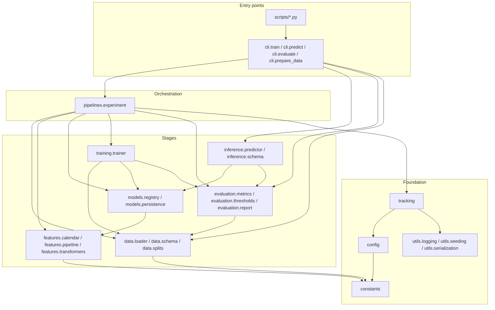
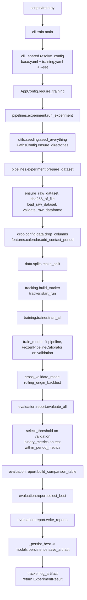
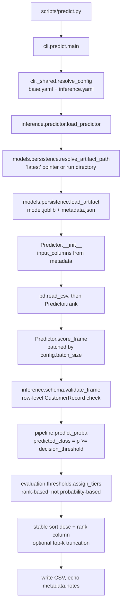

# Architecture

How the code in `src/term_deposit/` is arranged, why the dependencies point the way they do, and
where to edit to change something. Protocol: [methodology.md](methodology.md). Model:
[model-card.md](model-card.md).

## Design principles

**One-way dependency chain.** The package docstring in `src/term_deposit/__init__.py` states the
intended order:

```text
data -> features -> models -> training -> evaluation -> inference
```

Every module imports only from `constants`, `config`, `utils`, and stages to its left. Nothing imports
`pipelines` except `cli`, and nothing imports `cli` except `scripts/`. Any stage can therefore be
imported on its own: `tests/unit/test_metrics.py` imports `evaluation.metrics` and nothing else.

**Configuration is data.** Every value that can change a reported number lives in `configs/*.yaml`
and is parsed into frozen pydantic models in `src/term_deposit/config.py`. Hyperparameters are a
config diff, not a code diff. `AppConfig` is threaded through the call graph as a parameter.

**Preprocessing lives inside the estimator.** `features.pipeline.build_preprocessor` returns a fresh
unfitted `sklearn.pipeline.Pipeline`, and `models.registry.build_pipeline` appends the estimator to
its steps. There is no separate "transform, then fit" phase, so a transformer can never be fitted on
rows the model was not, and the transformation used in evaluation is replayed at scoring. See ADR
0008.

**Artifacts carry their own contract.** A saved run is a directory holding `model.joblib` and
`metadata.json`. `inference.predictor.Predictor` derives its input validation from that metadata, not
from the current config, so scoring an old artifact with a newer checkout still validates against
what that artifact was trained on.

**Thin entry points.** `scripts/train.py` is a short shim that puts `src/` on `sys.path` and calls
`term_deposit.cli.train.app`. The command module parses flags and prints a summary; orchestration is
one call to `run_experiment`. Entry points are testable and contain no logic worth testing.

## Module dependency graph

Arrows point in the direction of `import`. Edges into `constants`, `config` and `utils` are elided
where they would only add noise; every module depends on at least one of them.



One pair of edges is worth stating explicitly. **`training` imports `evaluation`, not the other way
round**: `training/trainer.py` imports `binary_metrics` from `evaluation/metrics.py` so each backtest
fold is scored as produced. And **`evaluation` does not import `training`**, though `evaluate_model`
needs a fitted model whose type is `training.trainer.TrainedModel` — importing it would close the
cycle `training -> evaluation -> training` and Python would fail at import time. Instead
`src/term_deposit/evaluation/report.py` declares a `@runtime_checkable` structural type:

```python
@runtime_checkable
class ScorableModel(Protocol):
    @property
    def name(self) -> str: ...
    def predict_proba(self, X: pd.DataFrame) -> np.ndarray: ...
```

`TrainedModel` satisfies it without knowing it exists. Beyond breaking the cycle, the inversion keeps
`evaluation` a leaf and lets any object with a name and a `predict_proba` be evaluated — a stub in a
test, or `models.persistence.ModelArtifact` via `evaluate_artifact`.

## Modules

| Path | Responsibility | Key public names |
|---|---|---|
| `src/term_deposit/constants.py` | Every fact about the *shape* of the dataset, in one file | `RAW_SHA256`, `RAW_ROW_COUNT`, `MACRO_FEATURES`, `CATEGORY_DOMAINS`, `PDAYS_NEVER_CONTACTED`, `POST_OUTCOME_COLUMNS` |
| `src/term_deposit/config.py` | Typed, layered, frozen configuration | `AppConfig`, `load_config`, `deep_merge`, `apply_overrides`, `parse_override`, `ConfigError`, `SplitConfig`, `FeatureConfig`, `TrainingConfig`, `EvaluationConfig`, `InferenceConfig` |
| `src/term_deposit/data/loader.py` | Fetch, checksum and read the raw CSV | `ensure_raw_dataset`, `download_raw_dataset`, `load_raw_dataset`, `sha256_of_file`, `DatasetNotFoundError`, `ChecksumMismatchError` |
| `src/term_deposit/data/schema.py` | Hand-rolled table contract for the training-side frame | `RAW_SCHEMA`, `TableSchema`, `ColumnSpec`, `validate_raw_dataframe`, `summarise_quality`, `SchemaValidationError` |
| `src/term_deposit/data/splits.py` | Train/validation/test construction and drift description | `make_split`, `DataSplit`, `SplitIndices`, `rolling_origin_folds`, `describe_drift`, `SplitError` |
| `src/term_deposit/features/calendar.py` | Reconstruct the missing year and attach `contact_period` | `add_contact_period`, `reconstruct_contact_period`, `period_summary`, `macro_period_collinearity`, `CalendarReconstructionError` |
| `src/term_deposit/features/transformers.py` | Custom scikit-learn transformers | `ColumnSelector`, `PdaysSentinelEncoder` |
| `src/term_deposit/features/pipeline.py` | Assemble the preprocessing pipeline | `build_preprocessor`, `resolved_numeric_columns`, `output_feature_names`, `SELECT_STEP`, `PDAYS_STEP`, `ENCODE_STEP` |
| `src/term_deposit/models/registry.py` | Config entry to unfitted estimator/pipeline | `build_estimator`, `build_pipeline`, `registered_estimators`, `MODEL_STEP`, `UnknownEstimatorError` |
| `src/term_deposit/models/persistence.py` | Write, resolve and load artifacts | `save_artifact`, `load_artifact`, `resolve_artifact_path`, `list_artifacts`, `ModelArtifact`, `ModelMetadata`, `ArtifactError` |
| `src/term_deposit/training/trainer.py` | Fit, calibrate, cross-validate, backtest | `train_all`, `train_model`, `cross_validate_model`, `rolling_origin_backtest`, `TrainedModel`, `FrozenPipelineCalibrator`, `CrossValidationResult`, `BacktestResult` |
| `src/term_deposit/evaluation/metrics.py` | Metric primitives | `binary_metrics`, `within_period_metrics`, `precision_at_k`, `recall_at_k`, `lift_at_k`, `expected_calibration_error`, `calibration_summary`, `bootstrap_interval`, `ClassificationMetrics` |
| `src/term_deposit/evaluation/thresholds.py` | Operating-point selection and tiering | `select_threshold`, `threshold_sweep`, `expected_value`, `assign_tiers`, `ThresholdChoice` |
| `src/term_deposit/evaluation/report.py` | Per-model reports, comparison, selection, files | `ScorableModel`, `EvaluationReport`, `evaluate_model`, `evaluate_all`, `build_comparison_table`, `select_best`, `write_reports`, `evaluate_artifact` |
| `src/term_deposit/evaluation/plots.py` (`viz` extra), `explain.py` (`explain` extra) | Optional figures and feature attribution | `plot_roc_curves`, `plot_calibration`, `plot_within_vs_pooled`, `plot_backtest`, `save_figure`; `permutation_feature_importance`, `native_feature_importance`, `shap_values`, `group_importance` |
| `src/term_deposit/inference/schema.py` | Row-level pydantic contract at the scoring edge | `CustomerRecord`, `ScoringRequest`, `ScoringResponse`, `ScoredCustomer`, `validate_frame` |
| `src/term_deposit/inference/predictor.py` | The only supported way to use a trained model | `Predictor`, `load_predictor`, `PredictorError` |
| `src/term_deposit/pipelines/experiment.py` | Owns the *order* of the stages and nothing else | `prepare_dataset`, `run_experiment`, `PreparedData`, `ExperimentResult` |
| `src/term_deposit/tracking.py` | Experiment tracking behind a Protocol | `ExperimentTracker`, `build_tracker`, `JsonlTracker`, `MlflowTracker`, `NullTracker` |
| `src/term_deposit/cli/` | Typer commands; one module per command | `app`, and `main` in `train.py`, `predict.py`, `evaluate.py`, `prepare_data.py`; `resolve_config` and `fail` in `_shared.py` |
| `src/term_deposit/utils/` | Logging, seeding, JSON serialisation | `configure_logging`, `get_logger`, `seed_everything`, `make_rng`, `write_json`, `read_json`, `append_jsonl`, `to_jsonable` |

## Runtime flow: `scripts/train.py`



Three ordering facts the diagram encodes on purpose. `duration` is dropped inside `prepare_dataset`,
before `make_split` exists, so no later stage can reintroduce it. The calibrator is fitted in
`train_model` on `split.X_validation` only and the threshold is chosen in `evaluate_model` on
validation scores — neither sees test labels. `select_best` prefers the mean backtest average
precision when every candidate has one and falls back to the single-window primary metric otherwise;
`_persist_best` ships `winner.scorer`, so artifact and report cannot disagree.

## Runtime flow: `scripts/predict.py`



Nothing is fitted on this path. `Predictor` refuses to construct if the metadata records no input
columns, and `validate_frame` reports up to five row-level violations at once so a malformed file can
be fixed in one pass. Tiers are assigned by rank, not absolute probability, so they survive a
recalibration.

## Configuration

Three layers, merged left to right, then validated once. First `configs/base.yaml` — paths, seed,
data contract, split, features, evaluation, tracking, inference — loaded by every entry point. Then a
task file: `configs/training.yaml` adds the `training:` section and the model list,
`configs/inference.yaml` narrows scoring; `cli/_shared.resolve_config` layers these via its
`extra_defaults` argument when no explicit `--config` is passed. Finally `--set dotted.key=value`
overrides, parsed as YAML so `--set split.strategy=random` and
`--set evaluation.top_k_fractions=[0.1,0.2]` both behave.

Merging is `deep_merge`: mappings merge key by key, everything else — lists included — is replaced
wholesale, so a config file can *shorten* the model list. Every node inherits from `_Frozen`:

```python
class _Frozen(BaseModel):
    model_config = ConfigDict(frozen=True, extra="forbid")
```

`frozen=True` means a config handed to `run_experiment` cannot be mutated halfway through a run, so
the configuration serialised into `metadata.json` is provably the one that was used.
`extra="forbid"` means a typo such as `split.strategey` fails at load time with a pointer to the
offending key, instead of being silently ignored and producing a run under the default strategy.

Node types: `PathsConfig`, `DataConfig`, `SplitConfig`, `FeatureConfig`, `ModelSpec`,
`CalibrationConfig`, `TrainingConfig`, `EvaluationConfig`, `ExplainabilityConfig`, `TrackingConfig`,
`InferenceConfig`, and the root `AppConfig`. `training` is `TrainingConfig | None`, so inference
commands can load a config with no model list; `AppConfig.require_training()` turns the absence into
an actionable message rather than an `AttributeError`. Cross-field rules live in `@model_validator`
methods — unique enabled model names, ascending tier quantiles with one more label than boundary, a
random split whose fractions leave room for training. Relative paths are resolved once, at the end of
`load_config`, against `$TERM_DEPOSIT_ROOT` or the inferred repository root.

## Extension points

| To do this | Edit this |
|---|---|
| Add a candidate model | Append a `ModelSpec` entry to `configs/training.yaml`. If the estimator is new, add a `_build_*` function and register it in `_BUILDERS` in `src/term_deposit/models/registry.py`, then extend the `estimator` `Literal` in `ModelSpec` in `src/term_deposit/config.py`. |
| Add a split strategy | Add a `_<name>_indices` function and a branch in `make_split` in `src/term_deposit/data/splits.py`, then extend the `SplitStrategy` `Literal` in `src/term_deposit/config.py`. The `else` branch in `make_split` is a deliberate runtime guard for exactly this edit. |
| Add a metric | Add the function to `src/term_deposit/evaluation/metrics.py` and a field to `ClassificationMetrics`; `binary_metrics` populates it and `metrics_to_row` carries it into the comparison table. |
| Swap the tracking backend | Implement the four methods of the `ExperimentTracker` Protocol in `src/term_deposit/tracking.py`, add a branch to `build_tracker`, and extend the `backend` `Literal` in `TrackingConfig`. Nothing in `pipelines/experiment.py` changes. |
| Add a feature transformer | Add the `BaseEstimator`/`TransformerMixin` class to `src/term_deposit/features/transformers.py` with a `get_feature_names_out`, then insert it into the step list in `build_preprocessor` in `src/term_deposit/features/pipeline.py`. Gate it behind a new `FeatureConfig` flag if it should be optional. |
| Change the feature set | Extend the `FeatureSet` `Literal` and the `numeric_columns`/`categorical_columns` methods on `FeatureConfig` in `src/term_deposit/config.py`. |
| Add a threshold objective | Add a branch in `select_threshold` in `src/term_deposit/evaluation/thresholds.py` and extend the `threshold_objective` `Literal` in `EvaluationConfig`. |

The pattern is consistent: a `Literal` in `config.py` is the registry's public contract and the
implementation is a dict entry or a branch. Forgetting it is a config-load failure, not a fallback.

## Artifact format

`save_artifact` writes a run directory and refreshes a sibling `latest` pointer — a symlink where the
filesystem allows one, a `latest.txt` file otherwise, so behaviour is the same inside containers.

```text
artifacts/20260813T194016Z__out_of_time__all/
├── model.joblib      # the fitted scorer, joblib-compressed
└── metadata.json     # the contract needed to use and audit it
```

`model.joblib` holds the calibrated scorer when calibration ran, the bare `Pipeline` otherwise.
Because preprocessing lives inside the pipeline, this single object is self-contained: no separate
encoder file, no ordering convention to remember. `metadata.json` fields:

| Field | Purpose |
|---|---|
| `schema_version` | Lets `ModelMetadata.from_dict` evolve without breaking old directories. |
| `model_name`, `estimator` | Which config entry and which registry key produced this. |
| `split_strategy` | Which evaluation protocol the recorded metrics belong to. Quoting a number without it is meaningless here — see the three protocol tables in the model card. |
| `feature_set` | `all` or `client_only`. |
| `input_columns` | The scoring contract. `Predictor` derives its validation and its column ordering from this, so a renamed upstream column fails loudly. |
| `decision_threshold`, `threshold_objective` | The operating point chosen on validation, and the rule that chose it. |
| `metrics` | Test, within-period, backtest and cross-validation numbers exactly as reported. |
| `created_at`, `git_revision` | When, and from which commit. |
| `library_versions` | Python, numpy, pandas, scikit-learn, xgboost and the package version. `load_artifact` warns on drift because an unpickled estimator can behave differently under another scikit-learn. |
| `config` | The full resolved configuration, so the run can be reproduced. |
| `data_checksum` | SHA-256 of the raw CSV the model was fitted on. |
| `notes` | Caveats surfaced by `scripts/predict.py` on every run — the protocol, the within-period warning, the `duration` exclusion, and an uncalibrated-probabilities warning when applicable. |

Both files are needed. `model.joblib` alone produces a number but not a defensible one: it does not
say which columns it expects, what threshold to apply, which protocol the metrics came from, or which
bytes of data it saw. `metadata.json` alone documents a model that no longer exists.

## Testing architecture

The suite runs against a synthetic frame built in `tests/conftest.py` by `_make_synthetic_frame`, not
against the 41k-row UCI CSV. The fixture reproduces the three properties the pipeline cares about —
rows in chronological order with month rollovers, macro indicators constant within each period, a
base rate drifting upward across periods — plus an injected within-customer signal so a model can
score above chance and tests can assert on ordering rather than on noise.

That choice buys three things. CI does not depend on UCI being reachable or on the upstream file
being unchanged — the `test` job in `.github/workflows/ci.yml` runs
`pytest -q -m "not requires_dataset"` with no download step. The suite is fast enough for every
commit, helped by `fast_training_config`. And each fixture encodes the property under test.

Two markers are declared in `pyproject.toml` under `[tool.pytest.ini_options]`:

| Marker | Meaning | Current use |
|---|---|---|
| `requires_dataset` | Needs `data/raw/bank-additional-full.csv` to be present | Applied in `tests/unit/test_calendar.py` and across `tests/integration/test_real_dataset.py`; the `require_dataset` fixture skips when the file is absent |
| `slow` | Trains real models on the full dataset | Applied to `TestProtocolGap` in `tests/integration/test_real_dataset.py`, which fits every configured model on all 41,188 rows (about 17 seconds, in a class-scoped fixture shared by its four assertions) |

`tests/integration/test_real_dataset.py` is where the documentation's claims are pinned against the
real file rather than against a fixture. It asserts the campaign window, that four macro features are
exactly period-constant, the named-month base-rate drift, and — in the `slow` class — that pooled
ROC-AUC exceeds the within-month value by more than 0.15 for every non-baseline model. If the
upstream data changed or a refactor altered the protocol, these fail before the README starts
stating numbers the code no longer produces.

`--strict-markers` and `--strict-config` are on, so a typo in a marker name is an error rather than a
silently unmarked test. Layout: `tests/unit/` for module-level behaviour; `tests/integration/` for
`test_pipeline.py`, a real `run_experiment` end to end on synthetic data, and `test_cli.py`.

## Deployment shape

Nothing in this repository is deployed. What exists is a build that could be deployed.

**`Dockerfile`** is a three-stage build. `builder` uses `python:3.12-slim-bookworm` plus `uv` and
installs dependencies from `uv.lock` *before* `src/` is copied, so editing a module does not
invalidate the slow layer. `runtime` uses the same slim base plus `libgomp1` for the XGBoost and
scikit-learn wheels; it copies the built `.venv`, `src/`, `scripts/` and `configs/`, creates a
non-root `app` user, sets `TERM_DEPOSIT_ROOT=/app`, declares a `HEALTHCHECK` that imports the package
and parses `configs/base.yaml`, and entry-points `term-deposit`. `dev` extends `runtime` with the dev
dependency group and `tests/`, defaulting to `pytest -q`.

**`docker-compose.yml`** defines one service per pipeline stage — `prepare-data`, `train`,
`train-random`, `evaluate`, `predict`, `test` — sharing a YAML anchor for the image, the environment
and the bind mounts (`./data`, `./artifacts`, `./reports` read-write; `./configs` read-only), so
results survive the container. `train` declares `depends_on: prepare-data` with
`condition: service_completed_successfully`.

**`docs/assets/mlops-deployment-architecture-azure.png`** is a design sketch of how this workload
could be operated on Azure. No infrastructure has been provisioned, no endpoint exists, no traffic is
served, and there is no Terraform, Bicep or ARM template here. Read it as a diagram of an intention,
not a description of a running system.
